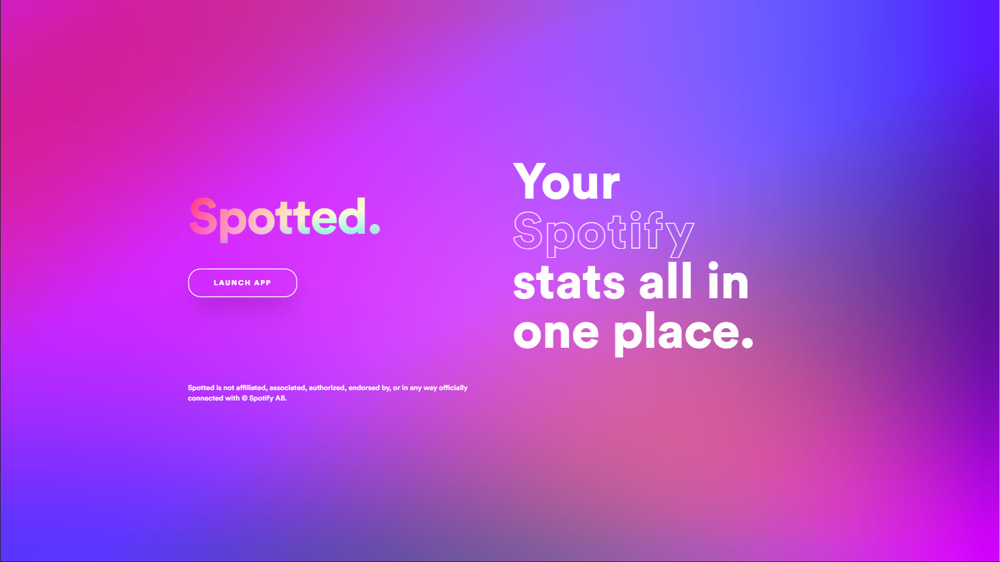
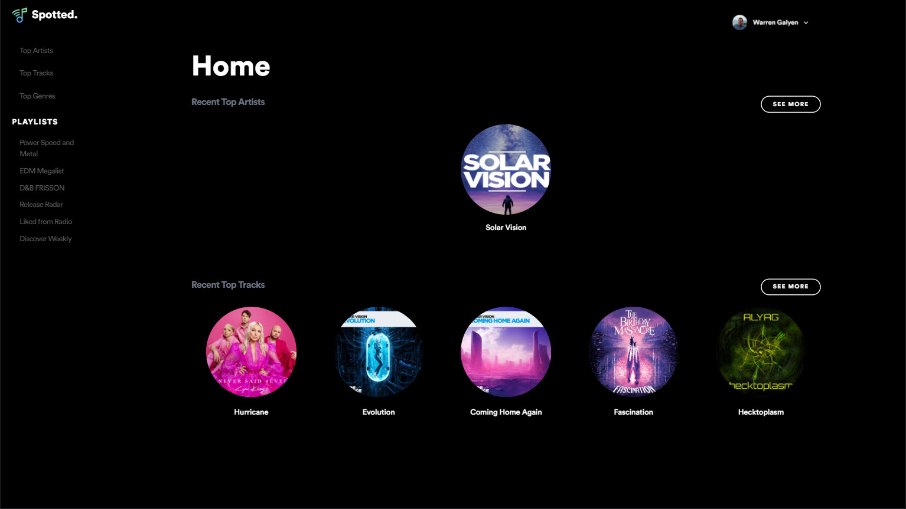
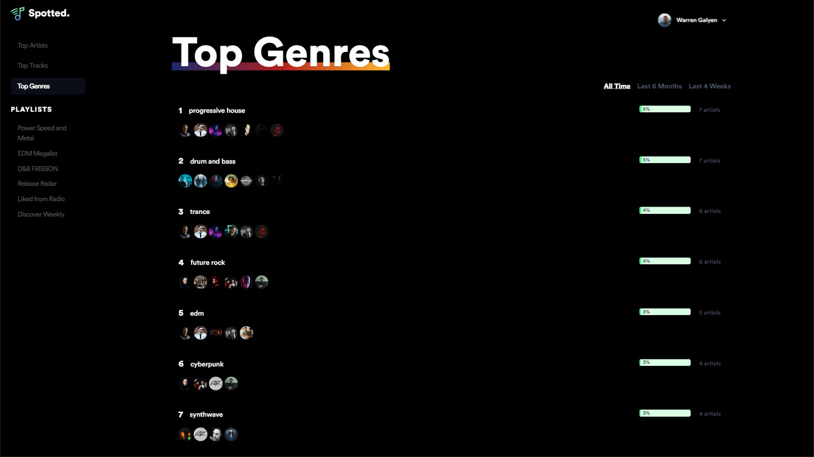
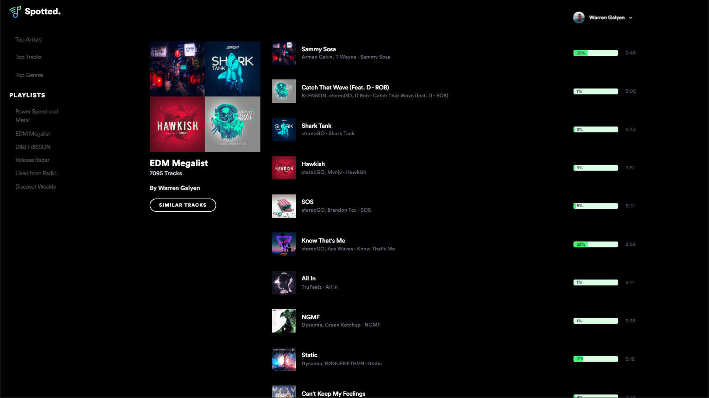
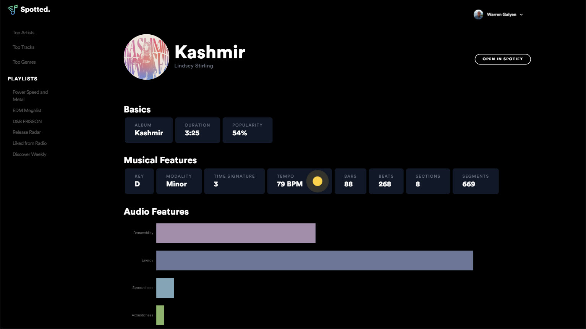

<h3 align="center">Your Spotify stats all in one place.</h3>

## ✨ Features

**Top Stats**

- View details for your top:
  - Artists
  - Tracks
  - Genres
- Get data broken down for:
  - Last 4 Weeks
  - Last 6 Months
  - All Time

**Playlist**

- Browse the playlists you follow or created.
- Get similar tracks for a given playlist.
- Export similar playlist to your Spotify account.

**Track**

- View track details including musical and audio features.
- Discover related tracks.

**Artist**

- View artist genres, follower count and popularity.
- View artist's top tracks.
- Discover similar artists.

## 🏗️ Built With

- ⚡ [Angular](https://angular.io/)  - a platform for building mobile and desktop web applications.
- 🎨 [Tailwind](https://tailwindcss.com/) - Rapidly build modern websites without ever leaving your HTML.
- 🎵 [Spotify](https://developer.spotify.com/documentation/web-api/) API - for fetching Spotify data.
- 📊 [Chart.js](https://www.chartjs.org/) - Simple, clean and engaging HTML5 based JavaScript charts.

## How it works

*Login page*

*Home*

*Top Genres*

*Similar Playlist*

*Track Details*
